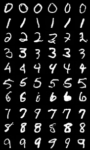
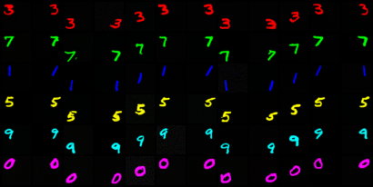
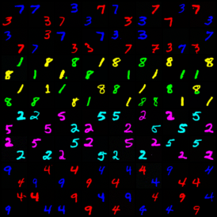

# Diffusion from scratch

DDPM and DDIM built up one piece at a time, on MNIST and a small colored-MNIST
variant, on a single RTX 4060. One concept per file in `src/`, each with a
`__main__` that tests it — run any file directly and it checks its own claims.

The point is not the samples. It is what each piece measurably does once it is
in, which is often not what the paper's summary suggests: the training loss is
blind to a sampler that has collapsed to a point mass, self-attention buys
nothing at 28x28, and four rounds of architecture aimed at binding "red" to "3"
all failed at chance until the objective was changed to ask for it — after which
the plainest of the four succeeded, having been capable the whole time.



```bash
uv sync
uv run src/main.py --epochs 15 --name first        # train, one sample grid per epoch
uv run src/sample.py first --label 3 --n 16 --w 3  # ask a trained run for digits
uv run src/ddim.py                                 # any file: run it, it tests itself
```

Runs land in `artifacts/{name}_{timestamp}/` with their `train.log` beside the
grids; `--name scratch` reuses one folder and wipes it each run.

---

# What's built

- `forward_process.py` — linear beta schedule + `q_sample`, buffers on an
  `nn.Module`. `extract` lives here.
- `timestep_embedding.py` — sinusoidal `t -> [B, dim]`, block layout.
- `resblock.py` — GroupNorm/SiLU/conv ×2, temb added in the middle, zero-init
  `conv2` so a fresh block is exactly its skip.
- `unet.py` — 28→14→7, mults (1,2,2), 4.17M params (4.72M with cross-attention).
  Zero-init output conv.
- `sampler.py` — ancestral DDPM, `sigma="beta"|"posterior"`.
- `ddim.py` — DDIM, `steps`/`eta`/`clip`. `eta=0` is deterministic; `eta=1` at
  full length reproduces DDPM's posterior variance, asserted against it.
- `main.py` — train on MNIST, sample a grid per epoch. `--sampler ddim|ddpm`,
  `--ddim-steps`, `--num-classes`.
- **class conditioning** — `UNet(num_classes=...)` embeds the label into `temb`,
  with a reserved untrained null row at index `num_classes` so CFG can reuse
  these weights. `Conditioned(net, y)` freezes `y` back into the `(x, t) -> eps`
  interface the samplers call, so neither sampler changed. `main.py` conditions
  by default and draws one class per grid row.
  → [what it showed](#class-conditioning)
- `loss_by_t.py` — per-sample eps-MSE accumulated into `t` buckets from the
  training draws themselves, no extra forward passes. `main.py` prints a row
  under a header of ranges each epoch (`--loss-buckets`, default 10); the epoch
  scalar is now the accumulator's count-weighted pooled mean.
  → [what it showed](#loss-bucketed-by-t)
- `ema.py` — `EMA`, a shadow copy of the weights trailing the trained ones
  (`min(decay, (1+n)/(10+n))` ramp so early epochs are not an average with the
  random init), plus an `as_weights` context manager that swaps them in for
  sampling and restores exactly. A pure observer: the training path is
  unchanged. `main.py` updates it per step, draws the epoch grid under it, and
  saves it beside `net` in the checkpoint. `--ema-decay 0` disables.
  → [what it showed](#ema-of-weights)
- `cosine_schedule.py` — `cosine_betas`, the Nichol & Dhariwal ᾱ curve turned
  back into betas, with `s` off the flat peak and a `max_beta` cap at the t=T
  singularity. `ForwardProcess(schedule="cosine")` and `main.py --schedule`.
  The default since 2026-09-09, for the reason given there.
  → [closed form](#cosine-vs-linear-closed-form), [trained head to head](#cosine-vs-linear-trained)
- `main.py --seed` — init, shuffling and noise, so two runs differing in one
  flag differ in that flag alone. Pairs runs; does not make them bitwise
  reproducible (cuDNN autotuning and atomics), which would need
  `use_deterministic_algorithms` and a throughput cost.
- `cfg.py` — classifier-free guidance. `drop_labels` swaps a fraction of labels
  for the reserved null token during training; `Guided(net, y, w)` freezes
  `(y, w)` into the samplers' `(x, t) -> eps` interface and returns
  `eps_∅ + w·(eps_y - eps_∅)`, both branches in one doubled batch. `main.py
  --label-dropout` (0.1 by default) and `--guidance`. `cfg.ipynb` sweeps it:
  the two curves, and the grids that show what the diversity number stops
  meaning past w≈8.
  → [what it showed](#classifier-free-guidance)
- `attention.py` — `Attention(ch, heads, groups, context_dim=None)`: self when
  `context_dim` is None, cross when it is set, zero-init output projection so a
  fresh block is its own skip. `UNet(attention=True)` puts one in the 7x7
  bottleneck (`main.py --attention`). Kept for the cross-attention path it
  provides, which is where it earned its place.
  → [what it showed](#self-attention-in-the-bottleneck)
- `sample.py` — ask a trained run for digits: `python sample.py <run> --label 3
  --n 16 --w 3`, or `--prompt "a red 3 in the top left"` for a captioned run.
  Rebuilds the net from the checkpoint alone (num_classes, vocab_size, channels,
  image size, attention, schedule), EMA weights by default, `--label -1` for one
  class per row. Older checkpoints are read off their own weights.
- `class_conditioning.ipynb` — probes against a trained checkpoint: label sweep
  at fixed `x_T`, the null row, right-vs-wrong label by `t`, conditional vs
  unconditional by `t`. Cell 1 is all imports and helpers; every probe below
  runs on its own.
- `colored_mnist.py` — 32x32 RGB MNIST with a caption per image: colour, digit
  and position drawn independently, and "a red 3 in the top left" written from
  the attributes that drew it. A 26-word closed vocabulary with a reserved
  `<null>` token (index 0, the caption analogue of the null label row) and a
  separate `<pad>`, so a short caption is not accidentally a partly-unconditional
  one. Attributes are a function of the MNIST index, so the set is identical
  every epoch and the held-out filter can run without loading an image.
  `HELDOUT` drops six colour x digit pairs — one per colour, six distinct digits,
  10% of the data — leaving every word trained and six combinations unseen.
  `read_color`/`read_position` recover the attributes from pixels, and are
  checked against the dataset that wrote them.
- **cross-attention through the U-Net** — `UNet(vocab_size=...)` embeds tokens
  into a context sequence and reads it with an `Attention(context_dim=...)` after
  every ResBlock and in the bottleneck. Deliberately *not* added to `temb`: the
  claim under test is that a pooled vector cannot bind an attribute to an
  object, so the caption's only route to a pixel is attention — asserted by
  zeroing the attention output projections on a trained net and watching the
  caption go inert. (That claim did not survive its control run on single-object
  images; see [captions and cross-attention](#captions-and-cross-attention) and
  item 1 below.) `y` is `[B]` labels or `[B, L]` tokens, so `Conditioned`,
  `Guided` and both samplers are unchanged. `drop_labels` now drops whole
  captions rather than individual words. State dict keys are untouched when
  `vocab_size` is None, so every earlier checkpoint still loads.
- `main.py --dataset colored` — trains the captioned net; the per-epoch grid is
  every colour x every digit, so the held-out cells are in the picture from
  epoch 1.
- `UNet(pooled=True)` / `main.py --pooled-context` — the control the item above
  needed: the same tokens meaned into one vector and added to `temb`, the way a
  class label is, with no attention anywhere.
  → [what it showed](#captions-and-cross-attention)
- `compositional.py` — the held-out eval. Generates every colour x digit pair,
  scores colour and position off the pixels and the digit with a small CNN judge
  trained on the *full* dataset (a judge that never saw a red 3 cannot grade
  one), and reports seen-vs-held-out. The seen column is the control for judge
  error. When a held-out pair fails it also reports which word was dropped —
  kept the colour and got the digit wrong, or the reverse — which is what
  separates recombining factors from recalling pairs.
- `two_objects.py` — two digits on one canvas, distinct colours, digits and
  corners, one caption naming both. The setting where the assignment is not
  recoverable from the multiset of words, which single-object images never were.
  `swap_colors` exchanges the two colour words (the probe the eval rests on) and
  `isolate` blanks all but one corner, so the single-object judge scores a
  two-object image without retraining. `swap_color_tokens` is the same swap on
  encoded tokens, for the training loop, asserted against the text version so the
  loss and the eval cannot disagree about what a negative is.
- `binding.py` — scores `colours present` (what a bag of words can get right)
  against `colours bound` (which colour went where). The failure mode is the
  clean swap, counted directly.
  → [what it showed](#two-objects)
- `text_encoder.py` — pre-norm self-attention + MLP over `[B, L, D]`, so each
  word's vector is rewritten in terms of the words around it before any pixel
  attends to it: the stage a real model gets from CLIP. Zero-init residual
  projections, as everywhere else here, and it does not own the embedding table,
  so every earlier captioned checkpoint still loads as the control.
  `UNet(text_layers=n)`, `main.py --text-layers`. Not needed for binding at this
  scale — no successful run has it — and kept for captions with real syntax,
  where contextualising the words should start to matter.
  → [what it showed](#a-text-encoder-does-not-fix-binding)
- `coords.py` — 2D sinusoidal position code for the cross-attention queries, so
  a query can say which position is asking. Added to Q only, never to the
  residual stream: the features flowing through the U-Net stay
  translation-equivariant, and it is the question that becomes
  position-dependent, not the image. Normalized to a canonical 32-pixel canvas
  rather than raw indices, so the same place gets the same code at every
  resolution the U-Net visits. Fixed rather than learned, because the previous
  positional signal here trained to 2% of its norm and never became usable — and
  a closed form adds no parameters, so `UNet(coords=True)` (`main.py --coords`)
  and its control have identical state dicts. Not needed for binding at this
  scale either, and kept for larger canvases where telling one location from
  another is genuinely hard.
  → [what it showed](#coordinates-do-not-fix-it-either-and-rule-out-the-architecture),
  [and the ablation](#what-was-actually-necessary)
- `negatives.py` — the loss term that charges for getting the assignment wrong.
  `swap_hinge` requires the colour-swapped caption to own more than half the
  pair's error: `mse_neg / (mse_pos + mse_neg) >= 0.5 + margin`. A *share* rather
  than a ratio, because "make the wrong caption score worse" otherwise has a
  cheaper solution than binding — be worse at everything — and a model that
  cannot tell the two captions apart raises both errors together. The first
  version of the file did exactly that and collapsed training to E[eps²] on
  contact; a share is invariant to wrecking both, so the escape route is closed
  by construction rather than by tuning. Scale-free across the 50x span of
  eps-MSE by `t`, and per-sample, so answers already right stop paying.
  `main.py --swap-weight` (0 is the plain objective) and `--swap-margin`, with
  the two branches in one doubled batch as CFG does it, dropped captions masked
  out (an all-null caption's swap is itself), and the per-epoch `hinge` printed
  beside the loss.
  → [what it showed](#charging-the-loss-for-the-assignment-fixes-it)

---

# What it showed

Measurements only; nothing below is a plan. Each run is named by its folder
under `artifacts/`.

## Unconditional DDPM/DDIM

Run `first_2026-09-06_15-43-23`. 15 epochs on MNIST, RTX 4060: 48s/epoch train.
Loss 0.0740 → 0.0267 (epoch 2) → 0.0221 (epoch 15). Samples are clean,
well-formed digits by epoch 15; epoch 5 is visibly worse.

**The loss lies.** It looks flat from epoch 2 on while sample quality keeps
improving a lot. Don't early-stop on it and don't use it to compare models.

> The reason first recorded here was wrong, and the correction is worth keeping.
> The claim was "eps-MSE is dominated by high `t`, where nobody beats chance".
> Bucketing it later (`class_conditioning.ipynb`, probe 4) shows the opposite:
> the average is dominated by **low** `t`. High `t` is the *easy* region, because
> `x_t ≈ eps` there and predicting eps is close to copying the input. The advice
> survives; the mechanism was backwards.

### Sampler cost — epoch-15 weights, same `x_T`

| sampler | time | range | across-sample std |
| --- | --- | --- | --- |
| DDIM 10 | 0.30s | `[-1.08, 1.12]` | 0.395 |
| DDIM 50 | 0.74s | `[-1.05, 1.09]` | 0.417 |
| DDIM 100 | 1.48s | `[-1.04, 1.09]` | 0.420 |
| DDPM 1000 | 14.92s | `[-1.05, 1.11]` | 0.388 |

DDIM at 50 steps is the default; even 10 steps is legible. Against the Gaussian
oracle the mean is exact at every step count while the std runs short — 0.3616
at 10 steps, 0.4728 at 50, 0.4986 at 1000, against 0.5. That deficit is
discretization error, not bias, and it closes monotonically with steps.

### `clip_denoised` is not optional for DDIM

DDIM forms the implied x0 explicitly, and `1/sqrt(ᾱ)` is 157 at t=999, so an
epoch-1 eps put the grid at `[-20.72, 22.11]`. Clamping x0 to `[-1,1]` each step,
and recomputing eps to match, gives `[-1.00, 1.00]` and legible digits. DDPM never
forms x0 and takes small steps, so it never needed this — its range settles near
`[-1.05, 1.09]`, slightly outside the data, because it does not clip.

### Deleting the noise term collapses the chain

Dropping `sigma * randn` from DDPM's step — keeping only the posterior mean —
doesn't merely reduce diversity, it destroys the sampler. Against the Gaussian
oracle the mean stays exact at 2.0000 while the std falls from 0.5 to **0.0016**:
a point mass. On MNIST all 64 samples land on one image (across-sample std
0.0027, smaller than the variation *within* a single image), and the 1000 steps
forget `x_T` entirely.

Which point they land on is a property of the weights, not of training progress:
epoch 4 gave 64 identical strokes, epoch 5 a blank field. Better ε-prediction
makes the contraction *tighter*, not safer.

**Deterministic is not the problem — dropping the variance is.** DDIM is fully
deterministic and fine, because its re-noising term puts the spread back using
the predicted eps. DDPM's mean without its variance is half a distribution used
as if it were a whole one.

**Training cannot see any of this.** Loss improved every epoch (0.0746 → 0.0238)
while the grids went to garbage. The objective scores one-step eps prediction
against known noise; nothing in the loop exercises the sampling chain. Only the
per-epoch grid catches it — or `sampler.py`'s oracle test, in about a second.

## Class conditioning

Run `cond_2026-09-09_11-42-46`. 15 epochs, same architecture and schedule as the
unconditional run, 4.17M params. Loss 0.0751 → 0.0214. Every grid row is cleanly
its own digit by epoch 15; at epoch 4 the rows are already legible with a few
strays.

**The label is load-bearing, proved in `unet.py`.** Overfit one digit per class,
then score the same `x_t` under the right label and a wrong one: eps-MSE 0.0218
vs 0.0867. A label that is wired up but ignored — added to `temb` and then
normalised away, say — passes every other check in the file and fails only that
one.

The probes below are `class_conditioning.ipynb`.

### `x_T` is a style code, `y` is an identity code

Hold `x_T` fixed down a row and vary the label across it. With `eta=0` the sample
is a deterministic function of `(x_T, y)`, so the label is the only variable.
Stroke weight and slant persist across all ten digits of a row, while identity
tracks the column. Nothing in the loss asked for that split.

### The null row is grey mush

Index `num_classes` was reserved and never received a gradient, and generating
with it produces noise. That is the concrete reason CFG's label dropout is not
optional: guidance extrapolates along `eps_cond - eps_uncond`, so an untrained
`eps_uncond` is noise that `w` then amplifies. After adding dropout, that column
should become plausible digits of no particular class.

### A wrong label hurts most mid-chain

Right vs wrong label on one model, 256 training images: 1.03x at t<200, **2.04x**
at t 400-600, back to 1.21x at t>800. Low `t` has the digit legible in `x_t`, so
the label is redundant. High `t` has `sqrt(ᾱ) = 0.016`, so the best prediction is
nearly *copy the input* and no label can help or spoil it much.

### The label pays off at high `t`, not low

Against the unconditional run above — same architecture, schedule and epoch
count — eps-MSE by `t` on **held-out** images, paired `t` and noise draws:

| t | uncond | cond | gain |
| --- | --- | --- | --- |
| 0-50 | 0.1127 | 0.1105 | 1.02x |
| 400-450 | 0.0190 | 0.0165 | 1.15x |
| 600-650 | 0.0053 | 0.0038 | 1.41x |
| 800-850 | 0.0010 | 0.0004 | 2.54x |
| mean | 0.0222 | 0.0210 | |

Both curves have the same steep shape — that is the eps objective, not the label;
an unconditional U-Net shows it too. The label lives in the gap, which widens
monotonically with `t`. At low `t` an unconditional net reads identity off `x_t`
directly and `y` adds nothing; at high `t` there is nothing left to read and `y`
is the only source.

Caveat: two independent runs, so part of the gap is seed, and the high-`t`
absolutes are tiny. CFG fixes this for free — label dropout yields both
predictions from one set of weights, dropping the second run and its seed.

### The eps-MSE profile across `t` — not conditioning-specific

0.116 at t<50 against 0.0002 at t>950, a ~550x span, with held-out tracking
train. It inverts the usual "high `t` is the irreducible floor" story: at high
`t`, `x_t ≈ eps`, so predicting eps is nearly copying the input; at low `t`, eps
is the small residue after a near-clean image and recovering it divides by
`sqrt(1-ᾱ) ≈ 0`, amplifying any error in the implied `x0`. So the per-epoch
average is dominated by low `t` and hides gains at high `t`.

## Loss bucketed by `t`

`loss_by_t.py`. `main.py` now prints the split every epoch, accumulated from the
training draws themselves. Two epochs, conditional, 10 buckets:

```
loss by t:    0-99 100-199 200-299 300-399 400-499 500-599 600-699 700-799 800-899 900-999
epoch 1  loss 0.0775
  by t:     0.2014  0.1127  0.0894  0.0758  0.0627  0.0533  0.0472  0.0448  0.0447  0.0435
epoch 2  loss 0.0264
  by t:     0.1122  0.0528  0.0370  0.0271  0.0181  0.0095  0.0041  0.0019  0.0012  0.0011
```

The offline probe's finding now shows up live, and one epoch of training makes
it dramatically worse: epoch 1 spans 5x across `t`, epoch 2 spans 100x. The
model learns high `t` almost immediately and then spends every later epoch on
low `t` — which is exactly the region the pooled scalar already reflects, so the
pooled number keeps moving while the buckets show *where*. Free: the per-sample
errors were being computed and thrown away.

Printed epoch loss is unchanged in meaning — it is the count-weighted pooled
mean, identical to the old `F.mse_loss` average.

## EMA of weights

Run `ema_2026-09-09_17-21-32`. 5 epochs, conditional, decay 0.999 with the
`(1+n)/(10+n)` warm-up ramp. The shadow copy costs one extra 4.17M-param buffer
and a multiply-add per step; epoch time is unchanged at 48s.

Held-out eps-MSE, 16k paired draws (same `t` and same noise for both nets), the
trained weights against their own EMA:

| t | trained | ema | ratio |
| --- | --- | --- | --- |
| 0-99 | 0.09357 | 0.09150 | 1.02x |
| 300-399 | 0.02376 | 0.02249 | 1.06x |
| 600-699 | 0.00313 | 0.00292 | 1.07x |
| 800-899 | 0.00039 | 0.00032 | 1.23x |
| 900-999 | 0.00025 | 0.00020 | 1.28x |
| pooled | 0.02277 | 0.02201 | 1.03x |

EMA wins in every bucket, and **the win grows with `t`**: 2% at the bottom, 28%
at the top. Same asymmetry as the label's, and for a related reason — high `t`
is where the target is nearly the input, so what remains to lose there is
largely gradient noise, which is exactly what averaging removes.

Note what the pooled number does to this: 1.03x. A 28% improvement in the region
the sampler starts from is reported as 3%, because low `t` dominates the
average. Without the bucketed log this would have read as noise.

Visually, at 5 epochs on MNIST the two grids (`compare_trained.png`,
`compare_ema.png`, same `x_T`) are both clean and the difference is not
convincing by eye — a few digits differ in identity, neither set is obviously
better. Across-sample std 0.3877 trained vs 0.3707 EMA. The measurable claim
here is the held-out loss; the visible-quality claim from the literature is for
longer runs and harder data than this.

## Cosine vs linear, closed form

`cosine_schedule.ipynb`. Both schedules are arithmetic, so this holds before any
model exists.

| | ᾱ < 0.5 at | steps at SNR < 0.1 | ᾱ_T |
| --- | --- | --- | --- |
| linear | t=259 | 52% | 4.04e-05 |
| cosine | t=496 | 20% | 2.43e-09 |

Linear spends **half its steps** where SNR < 0.1 — x_t is essentially noise and
there is little left to predict — and reaches half-destroyed by t=259. Cosine
pushes that to t=496 and cuts the near-noise region to a fifth of the steps.

It is not "less noise overall": cosine ends four orders of magnitude *more*
destroyed (ᾱ_T = 2e-9 vs 4e-5). Linear still leaks a trace of the image into
x_T, which is a train/sample mismatch, since sampling starts from pure noise.
Cosine is a better *allocation* of the same T steps at both ends.

The digit strip in the notebook shows the same thing directly: same x₀, same ε,
and linear's 3 is unreadable by t=500 while cosine's survives to t≈600.

Whether it helps a trained model is the next section.

## Cosine vs linear, trained

Runs `sched_lin_2026-09-09_17-49-05` vs `sched_cos_2026-09-09_17-53-11`. 5 epochs
each, `--seed 0`, identical in every flag but `--schedule`. Same init, shuffle,
`t` draws and noise, so the schedule is the only difference. (Seeding arrived
with this comparison; every earlier run in this file is unseeded.)

**The printed loss is meaningless across schedules.** Linear ends at 0.0232 and
cosine at 0.0400, and this says nothing — the same `t` is a different amount of
noise under each, so the two numbers are averages over different tasks. Cosine's
number is larger because cosine *spends more of its steps* at low noise, where
eps-MSE is high. Reading these two scalars against each other would say linear
won by 70%.

Matched on ᾱ instead — at equal ᾱ the input `x_t` is literally the same tensor,
and only the `t` index each net is told differs — on the held-out set, EMA
weights:

| ᾱ | t_lin | t_cos | linear | cosine | lin/cos |
| --- | --- | --- | --- | --- | --- |
| 0.99 | 27 | 56 | 0.10597 | 0.10480 | 1.011x |
| 0.90 | 97 | 198 | 0.05892 | 0.05755 | 1.024x |
| 0.70 | 184 | 363 | 0.03784 | 0.03718 | 1.018x |
| 0.50 | 258 | 495 | 0.02928 | 0.02882 | 1.016x |
| 0.30 | 342 | 627 | 0.02269 | 0.02253 | 1.007x |
| 0.10 | 475 | 793 | 0.01308 | 0.01314 | 0.995x |
| 0.03 | 587 | 887 | 0.00547 | 0.00571 | 0.959x |
| 0.01 | 673 | 935 | 0.00213 | 0.00232 | 0.919x |
| 0.001 | 825 | 979 | 0.00036 | 0.00057 | 0.629x |

The trade is exactly the one the schedule was designed to make, and nothing
more. Cosine is 1-2% better across the low-noise half, where it now spends its
steps; linear is better in the high-noise tail, by up to 58% at ᾱ=0.001, because
it spends half its budget there. Capacity moved; it was not created.

No visual winner at this scale (`grid.png` in each run, same `x_T`, same labels):
both are clean digits, across-sample std 0.3675 linear vs 0.3790 cosine.

**Verdict: cosine is not a win on MNIST at 5 epochs.** The Improved-DDPM result
is on 64x64 ImageNet, where the model is capacity-bound and the wasted
high-noise steps are a real cost; here a 4.17M-param net on 28x28 has capacity
to spare, so buying low-noise accuracy with high-noise accuracy nets out flat.
The cheap 1-2% gain sits in the region that matters most for perceptual detail,
which is the argument for keeping it — not the loss numbers. Kept: `--schedule`
defaults to cosine from 2026-09-09.

## Classifier-free guidance

Run `cfg_2026-09-09_18-17-27`. 8 epochs, cosine, label dropout 0.1, EMA weights,
DDIM 50. Obedience is judged by a small CNN trained on MNIST for the purpose
(98.3% test accuracy); diversity is across-sample pixel std within each class, at
a fixed `x_T` shared by every w.

| w | label accuracy | diversity | pixels at ±1 |
| --- | --- | --- | --- |
| 0.0 | 0.065 | 0.3631 | 0.499 |
| 1.0 | 0.945 | 0.3091 | 0.510 |
| 1.5 | 0.990 | 0.2948 | 0.519 |
| 2.0 | 0.995 | 0.2876 | 0.513 |
| 3.0 | 1.000 | 0.2798 | 0.480 |
| 5.0 | 1.000 | 0.2768 | 0.381 |
| 8.0 | 1.000 | 0.2789 | 0.239 |
| 15.0 | 1.000 | 0.2966 | 0.115 |

The trade is exactly as advertised, and it is cheap: **w=1.5 buys 4.5 points of
obedience for 5% of the diversity**, and by w=3 the judge is never wrong. w=0 is
the sanity check — 6.5%, below the 10% a coin would get, because unconditional
samples are not reliably any digit.

Two MNIST-specific surprises:

**Diversity is not monotonic.** It bottoms out at w=5 (0.2768) and *rises* again
by w=15 (0.2966). That is not returning variety — it is damage. Past w≈8 the
strokes erode into hollow, speckled outlines, and the speckle is pixel variance
the metric cannot tell apart from genuine variation. Any diversity number needs
the grid beside it.

**Nothing oversaturates.** The literature's "oversaturated garbage" at high w is
an RGB failure; here the fraction of pixels pinned at ±1 *falls* by more than
half, 0.51 → 0.115. Overshooting eps thins the strokes rather than blowing out
colour, and DDIM's x0 clamp absorbs what is left. Same mechanism, different
symptom — the failure mode is legibility, not saturation.

Cost is one extra forward per step at w≠1, batched into one pass. `Guided`
short-circuits to a single call at w=1 exactly, where the two branches cancel.

Reproduced in `cfg.ipynb`. Re-running moves the top of the accuracy curve by
about half a point (w=2 read 0.995 once and 1.000 the next time) — cuDNN is
nondeterministic, and `--seed` pairs runs without making them bitwise equal.
Differences that small are not findings.

## Self-attention in the bottleneck

Runs `attn_off_2026-09-09_18-51-37` vs `attn_on_2026-09-09_18-58-11`. 8 epochs
each, `--seed 0`, identical but for `--attention`. One `Attention` block between
the two bottleneck ResBlocks: +66k params (4.173M → 4.239M), +1s/epoch.

Held-out eps-MSE by `t` — same schedule and seed, so the buckets line up:

| t | off | on | ratio |
| --- | --- | --- | --- |
| 0-99 | 0.10915 | 0.10898 | 1.002x |
| 300-399 | 0.03746 | 0.03755 | 0.998x |
| 600-699 | 0.02072 | 0.02079 | 0.997x |
| 900-999 | 0.00171 | 0.00171 | 0.996x |
| pooled | 0.03680 | 0.03680 | 1.000x |

**No effect.** Every bucket is within 0.4%, and the pooled numbers are identical
to five decimals. Label accuracy 0.920 off vs 0.935 on at w=1, which is inside
the ±1 point this setup wobbles by; both are 1.000 at w=3.

Expected, and worth stating plainly: at 28x28 with a 7x7 bottleneck, a stack of
3x3 convs already has a receptive field covering the whole image by the time it
reaches the middle. Attention's advantage is reach, and there is no reach left to
buy. It pays on 64x64+ where the bottleneck is still large relative to the
features that must agree.

So this block earns its place as **infrastructure, not quality**: the same class
with `context_dim` set is cross-attention, which is the only mechanism that can
bind "red" to "3" and "top left" to a position. That is the next section, and it
is where this gets measured properly.

## Captions and cross-attention

Runs `caption_2026-09-09_20-18-28` vs `pooled_2026-09-09_21-26-36`. Colored MNIST
on a 32x32 canvas, captioned "a red 3 in the top left". Six colour x digit pairs
held out of training (red 3, green 7, blue 1, yellow 5, cyan 9, magenta 0) — one
per colour, six distinct digits, 10% of the images. Every word is trained; six
combinations are never shown.

30 epochs each, batch 64, `--seed 0`, cosine schedule, w=3 at sample time.
Identical but for how the caption reaches the net:

- **caption** — cross-attention. The caption stays a sequence of 7 word vectors,
  read by an `Attention` block after every ResBlock and in the bottleneck. 4.72M
  params, 72s/epoch.
- **pooled** — the baseline. Same token embeddings, meaned into one vector and
  added to `temb` exactly as a class label is. No attention anywhere. 4.21M
  params, 53s/epoch.



Scored by `compositional.py`: 960 samples, colour and position read off the
pixels, digit read by a CNN judge trained on the full dataset including the
held-out pairs (a judge that never saw a red 3 cannot grade one).

| | colour | digit | position | all three |
| --- | --- | --- | --- | --- |
| cross-attention, seen (54 pairs) | 1.000 | 0.993 | 1.000 | 0.993 |
| cross-attention, held out (6) | 1.000 | 0.990 | 1.000 | 0.990 |
| pooled, seen (54 pairs) | 1.000 | 1.000 | 1.000 | 1.000 |
| pooled, held out (6) | 1.000 | 0.990 | 1.000 | 0.990 |

**Compositional generalization is real and complete.** Both nets draw red 3s
they were never shown, in the right colour, at all five positions. Held-out
scores sit inside the seen scores' noise — one miss in 96 samples for each, and
in both cases the model kept the colour and drew a neighbouring digit. Colour
and digit are learned as separate factors, not memorised as pairs.

**And cross-attention was not needed for any of it.** That is the finding, and
it contradicts the reason this item was written. The pooled net matches it on
every column while being provably a bag of words: swapping "red" and "top" in
the token sequence changes its eps prediction by exactly 0.00000, against 0.024
for the cross-attention net. It cannot tell "a red 3 in the top left" from "a
top 3 in the red left", and it does not need to.

Why the test does not bite: **there is one object in the image**. Binding
failure requires two things competing for attributes — the "red cube and blue
sphere" that returns a blue cube. With a single digit on the canvas, the bag
{red, 3, top-left} is unambiguous, because there is only one slot to put it in.
Cross-attention resolves an ambiguity this dataset never creates.

The eps-MSE never hinted at any of it. Final `by t` rows are the same to three
decimals at every bucket:

| t | cross-attention | pooled |
| --- | --- | --- |
| 0-99 | 0.0191 | 0.0187 |
| 300-399 | 0.0050 | 0.0051 |
| 600-699 | 0.0028 | 0.0028 |
| 900-999 | 0.0003 | 0.0003 |
| pooled scalar | 0.0053 | 0.0052 |

Which is the second lesson: the training loss cannot see this question at all.
Neither can the per-epoch grid — both look correct — and neither, it turns out,
can a held-out-combination eval on single-object images. The control run is the
only thing that separated the two mechanisms, and it separated them by showing
they are the same here.

Caveats. The pooled net has 12% fewer parameters, since removing attention
removes weights — irrelevant to a null result, but it would have been a
competing explanation had pooled lost. The judge reads real MNIST test digits at
0.968 and generated ones at ~0.99, because w=3 sharpens samples toward cleaner
prototypes than real handwriting; so 0.990 is agreement with an imperfect ruler,
and only the seen-vs-held-out *gap* is trustworthy. Both columns pass through
the same ruler, so the gap is.

What would actually test binding: **two digits per image**, "a red 3 in the top
left and a blue 7 in the bottom right". Then the pooled vector carries {red, 3,
blue, 7, top-left, bottom-right} with no record of which colour goes with which
digit, and the sum genuinely cannot represent the answer. That is the next
section, and this run is the control it needs.

## Two objects

Runs `pair_cross_2026-09-09_22-09-02` vs `pair_pooled_2026-09-09_22-51-58`. The
control the previous section asked for. Two digits per 32x32 canvas, two distinct
colours, two distinct corners, one caption naming both: "a red 3 in the top left
and a blue 7 in the bottom right". Now the assignment is not recoverable from the
multiset of words, so a pooled caption provably cannot express it.



30 epochs each, batch 64, `--seed 0`, w=3. Scored by `binding.py`: each named
corner is blanked out of the canvas and read separately, colour off the pixels
and digit by the same judge as before. `colours present` asks whether both
colours appear anywhere; `colours bound` asks whether each is on its own digit.
The gap between them is the binding failure.

| | colours present | colours bound | colours swapped | digits bound | both bound |
| --- | --- | --- | --- | --- | --- |
| control (real images) | 1.000 | 1.000 | 0.000 | 0.934 | 0.934 |
| cross-attention | 0.842 | 0.405 | 0.436 | 0.396 | 0.183 |
| pooled | 0.844 | 0.418 | 0.426 | 0.390 | 0.193 |

**The binding failure reproduces exactly, and cross-attention does not fix it.**
Both models paint the right two colours and the right two digits and then assign
them to positions at chance. If a model gets both colours into the image and then
picks an assignment by coin flip, it scores `present/2` on bound: predicted 0.421
and 0.422, observed 0.405 and 0.418. Not approximately chance — chance.

This is the "red cube and blue sphere" failure, at MNIST cost. The words are all
there; the binding is not.

**Why cross-attention did not help, which is the actual finding.** The context it
attends to is raw token embeddings plus a learned positional offset, and that
offset never grew:

| | mean norm per token |
| --- | --- |
| `token_emb` (word identity) | 11.19 |
| `token_pos` (which slot) | 0.235 |

Two percent. So the vector at slot 1 is "red" and the vector at slot 9 is "blue",
with almost nothing recording that one sits in the first clause and one in the
second. Attending to that sequence is attending to a bag. Exchanging the two
colour words moves the prediction by 0.0104 for cross-attention against 0.0008
for pooled — thirteen times more responsive, and both negligible against an eps
of order 1.

Cross-attention supplies a *mechanism* for per-position lookup. It does not
supply anything to look up. In a real text-to-image model the tokens arrive from
a transformer text encoder, whose self-attention has already contextualised them:
the vector at "red" encodes *red, modifying the 3, in the first clause* before
cross-attention ever sees it. That contextualisation is the part doing the
binding, and this project does not have it. Zero-initialising `token_pos` made it
worse — the net can drive the loss down on word identity alone, so the gradient
pressure to grow a positional signal is weak and it stays near zero.

The eps-MSE is blind again, to three decimals at every bucket (0.0098 pooled
scalar for both; 0.0334 vs 0.0331 at t=0-99, 0.0006 vs 0.0006 at t=900-999). Three
runs now where the training loss cannot see the question being asked.

Caveats. `both bound` is capped near 0.93 by judge error on isolated corners, so
read the colour columns, which the control reads perfectly. 16% of samples do not
contain both requested colours at all, which is a separate and smaller failure
folded into `present`. And "cross-attention does not help *here*" is a statement
about a context with no text encoder in front of it — not about cross-attention.

What this predicts: give the tokens a real encoder — self-attention over the
sequence, positional embeddings that actually train — and `colours bound` should
separate from `present` in a way neither run above shows. That is the next
section, and these two runs are its control.

## A text encoder does not fix binding

Run `pair_encoder_2026-09-09_23-46-51`. The previous section blamed the context:
cross-attention had only word embeddings plus a positional offset at 2% of their
norm to look up, so attending to it was attending to a bag. The fix should have
been self-attention over the tokens, which is the stage a real model gets from
CLIP. Two blocks, `--text-layers 2`, 5.12M params against 4.72M, everything else
identical to `pair_cross`.

Stated in advance: `colours bound` should separate from `colours present`.

| | colours present | colours bound | colours swapped | both bound |
| --- | --- | --- | --- | --- |
| pooled | 0.844 | 0.418 | 0.426 | 0.193 |
| cross-attn | 0.842 | 0.405 | 0.436 | 0.183 |
| cross-attn + text encoder | 0.840 | **0.402** | 0.438 | 0.177 |

**It did not move.** Still `present/2`, still chance. The prediction was wrong.

The encoder is not what failed. It trained — both zero-init projections in both
blocks grew off zero (attention `|W|` 2.43, MLP `|W|` 3.21) — and it
contextualises: changing the word at slot 9 moves the vector at slot 2 by 0.064,
which is exactly the property the old context lacked. The stage works. It changes
nothing downstream.

Where it actually breaks, measured on real images by scoring a correct caption
against the same caption with its two colour words exchanged:

| t | correct | colour-swapped | null | swap/correct | null/correct |
| --- | --- | --- | --- | --- | --- |
| 0-199 | 0.0221 | 0.0221 | 0.0230 | **1.000** | 1.038 |
| 400-599 | 0.0070 | 0.0070 | 0.0080 | **1.000** | 1.141 |
| 800-999 | 0.0012 | 0.0012 | 0.0019 | **1.000** | 1.612 |

The caption is used, and used hardest exactly where it should be — at high `t`
the model is 61% better with it than without. The *assignment inside* the caption
is worth nothing anywhere. Not "less at low t", where `x_t` already shows the
colours: nothing, at every noise level, to three decimals.

So the model never learned to condition on which colour goes with which digit,
and the failure is upstream of both the encoder and the sampler. Guidance does
not recover it either — `colours bound` is flat from w=1 to w=12 (0.500, 0.481,
0.488, 0.481) while `colours present` holds at 0.94. There is no weak signal for
guidance to amplify.

**The next suspect is the image side, not the text side.** Cross-attention binds
by matching a query against the words that concern it, and the query is a feature
vector at one spatial location. Convolutions are translation-equivariant, so
those features carry no absolute coordinates beyond what zero-padding leaks. A
query in the top-left cannot reliably say *I am the top-left one*, and if it
cannot say that, it cannot select the clause that names it — however well
contextualised the clause is.

This fits what the single-object runs did: those placed digits at named positions
perfectly (1.000), but that needs no per-position discrimination — one global
instruction moves the only object. Two objects need the top-left features to
select clause 1 while the bottom-right features select clause 2, in the same
forward pass. That is the capability nothing here has.

Four runs now with the same eps-MSE to four decimals (0.0098, 0.0098, and 0.0098)
and four different answers to the question that matters.

## Coordinates do not fix it either, and rule out the architecture

Run `pair_coords_2026-09-10_12-30-47`. The previous section blamed the image
side: a query built by translation-equivariant convolutions cannot say *I am the
top-left one*, so it cannot select the clause that names it. `coords.py` gives it
a fixed 2D sinusoidal position code, added to Q only. Fixed rather than learned,
because the last learned positional signal here died at 2% of its norm; and it
adds no parameters, so this run and `pair_cross` have identical state dicts and
the comparison is the coordinates alone. 4.72M params both, 83s/epoch both.

Stated in advance, again: `colours bound` should separate from `colours present`.

| | colours present | colours bound | colours swapped | both bound |
| --- | --- | --- | --- | --- |
| pooled | 0.844 | 0.418 | 0.426 | 0.193 |
| cross-attn | 0.842 | 0.405 | 0.436 | 0.183 |
| cross-attn + text encoder | 0.840 | 0.402 | 0.438 | 0.177 |
| cross-attn + coords | 0.849 | **0.419** | 0.430 | 0.191 |

**It did not move.** `present/2` is 0.4245 against an observed 0.419. Chance for
the fourth time, and the second prediction in a row to fail.

**The coordinates are not what failed** — and unlike the last two suspects, this
one can be cleared rather than merely defended. Same weights, same input, one
intervention at a time, mean |Δeps| on real images:

| t | drop the whole caption | remove the coordinates | swap the two colour words |
| --- | --- | --- | --- |
| 0-200 | 0.0116 | 0.0105 | 0.0002 |
| 400-600 | 0.0078 | 0.0067 | 0.0001 |
| 800-1000 | 0.0102 | 0.0083 | 0.0001 |

The coordinates carry **nearly as much weight as the entire caption** — 0.0105
against 0.0116. This is not `token_pos` repeating: that signal was vestigial,
this one is load-bearing, and the net reads it hard at every noise level. Every
part of the mechanism is now present and demonstrably used.

And exchanging the two colour words still moves the prediction by 0.0002, fifty
times less, with `swap/correct` on eps-MSE at **exactly 1.000** in every bucket —
the same three decimals the text-encoder run gave. The model has learned "put
things in the named corners" and "these colours and digits appear" as separate
competencies, to a high standard, and has never learned the join between them.

So four architectural suspects have now been eliminated in turn: pooling, no
cross-attention, no contextualised text, no coordinates. What is left is the
objective. **Nothing in the eps-MSE ever charges the model for getting the
assignment wrong.** Painting a yellow 0 and a magenta 4 in the two named corners
scores 1.000 against painting the swap, so gradient descent is indifferent
between them — and a model indifferent between two answers picks by coin flip,
which is precisely the number `binding.py` keeps reporting. The architecture was
never the bottleneck; it was capable all along and was never asked.

Five runs now, five different mechanisms, and one pooled loss of 0.0098 that
cannot tell any of them apart.

## Charging the loss for the assignment fixes it

Runs `pair_swap_2026-09-10_14-09-12` (cross-attention + coordinates) and
`pair_swap_cross_2026-09-10_16-19-22` (cross-attention alone). 30 epochs, batch
64, `--seed 0`, w=3 — identical to their controls in every flag but
`--swap-weight 0.1`.

Four runs had eliminated four architectural suspects, which left the objective.
`negatives.py` scores the same `x_t` under the caption's colour-swapped twin and
requires it to be worse, then adds that to the eps-MSE. One extra forward pass,
batched the way CFG already batches its two branches.

| | colours present | colours bound | colours swapped | both bound |
| --- | --- | --- | --- | --- |
| control (real images) | 1.000 | 1.000 | 0.000 | 0.934 |
| pooled | 0.844 | 0.418 | 0.426 | 0.193 |
| cross-attn | 0.842 | 0.405 | 0.436 | 0.183 |
| cross-attn + text encoder | 0.840 | 0.402 | 0.438 | 0.177 |
| cross-attn + coords | 0.849 | 0.419 | 0.430 | 0.191 |
| **cross-attn + hinge** | **1.000** | **1.000** | **0.000** | **0.995** |
| **cross-attn + coords + hinge** | **1.000** | **1.000** | **0.000** | **0.995** |

**Zero clean swaps in 960 samples**, against roughly 430 in every run above.
`both bound` beats the real-image control (0.995 vs 0.934) only because w=3
sharpens generated digits into cleaner prototypes than real handwriting — the
judge reads them more easily than it reads MNIST.

The eps-MSE probe says the same thing about the mechanism rather than the
outcome. Scoring a correct caption against its colour-swapped twin on real
images gave **exactly 1.000**, at every noise level, in all four failures:

| t | correct | colour-swapped | swap/correct | (all four controls) |
| --- | --- | --- | --- | --- |
| 0-200 | 0.0219 | 0.2270 | **10.39x** | 1.000 |
| 400-600 | 0.0070 | 0.0676 | **9.65x** | 1.000 |
| 800-1000 | 0.0010 | 0.0034 | **3.55x** | 1.000 |

And it is legible while training, which nothing else here was. The hinge is
pinned at its margin while the model is indifferent and falls as it separates
the two captions:

```
epoch     1     4     5     6     8    12    16    20    30
cross    0.100 0.100 0.034 0.003 0.002 0.001 0.001 0.001 0.001
+coords  0.100 0.100 0.100 0.100 0.100 0.076 0.002 0.001 0.001
```

### What was actually necessary

Reading the table by column instead of by row: every architecture fails under
the plain objective, and both tested architectures succeed under the new one.
The variable is the loss, in every direction it is sliced.

- **The coordinates are unnecessary.** `pair_swap_cross` drops them and matches
  on every column, converging *sooner* (epoch 5 against 12). They were not idle
  either — removing them from the trained `pair_coords` moved its eps by 0.0105
  against 0.0116 for deleting the whole caption. A heavily used mechanism that
  contributed nothing to the outcome.
- **The text encoder was never in a working configuration.** Neither successful
  run has it.
- **Cross-attention is the one piece that survives**, and its role is narrow: it
  is the only mechanism that can *represent* the distinction. A pooled caption
  and its colour swap produce a bit-identical vector — `0.00000000`, because an
  average does not depend on order, and that holds however large the positional
  embedding grows. The hinge would be demanding a difference that does not exist
  in the input, so `pooled + hinge` is impossible by construction rather than by
  measurement, and is not run.

**Binding was never blocked by capability. It was blocked by incentive.** The
encoder and the coordinates both made the model *more able* to represent which
colour goes where, and nothing ever rewarded doing so, so the capacity went to
what the loss did reward — cleaner denoising, better placement. `pair_cross`,
the second run of this whole sequence, could already do this. It took four more
runs to notice that the problem was the thing being held fixed.

Caveats. `colours present` also rose (0.849 to 1.000), so part of the gain is
painting both requested colours more reliably, not only assigning them — the
`swapped` column, which goes to exactly zero, is the cleaner claim. The
swap probe is trained on directly, so a 10x ratio is partly the term doing as it
was told; `binding.py` scoring generated pixels is the independent measurement.
`cross + text encoder + hinge` is untested, so the encoder is shown to be
unnecessary, not useless. And the faster convergence without coordinates is one
pair of seeds — it could be interference, or it could be noise, and this cannot
separate them.

Scope: two objects, a 15-token template, a 32x32 canvas. Coordinates should earn
their place where spatial discrimination is genuinely hard and a text encoder
where captions have real syntax, the same way `--attention` buys nothing at 28x28
and would pay at 64x64. What travels is the method, not the null results:
**before adding mechanism, check whether the objective can see the thing being
fixed.** Six runs and one afternoon say that check is cheap and skipping it is
not.

---

# What's next

Ordered. The binding thread is closed; (1) is the one that moves this project
forward rather than sideways.

1. **Flow matching / rectified flow** — DDPM/DDIM is the SD1/SD2-era
   formulation; SD3 and Flux use a straight-line path from noise to data,
   predicting velocity instead of eps. Simpler than what is already written —
   no beta schedule, no posterior-variance algebra — and it slots in beside
   `sampler.py` as a peer, sharing the same U-Net. The item that makes this
   project about image generation as practised now rather than as it was.

2. **Measure the speed knobs** — every run here is fp32 at batch 64 on an 8GB
   4060, and a scratch benchmark of the training step suggests that is leaving a
   lot on the table: 173 s/epoch as run, against 135 with bf16 autocast, 123
   adding `channels_last`, and 80 adding `torch.compile`. Those are step timings
   from a throwaway script, not runs — nothing here has been trained under them
   and the effect on sample quality is unmeasured, which is the whole point of
   doing it properly. Worth a table beside the sampler-cost one, since a single
   consumer GPU is what most people reading this have. Larger batches OOM'd in
   that probe on memory the compile run had not released, so what batch 128
   actually costs is still unknown.

3. **`cross + text encoder + hinge`** — the one untested cell of the ablation.
   The encoder is shown to be unnecessary for binding, not useless; this says
   whether it helps, interferes, or does nothing, and it is one run.

---

If you are working through diffusion yourself and something here is wrong, or
you have run the same probe and got a different number, open an issue — that is
the most useful thing this repo can get.
